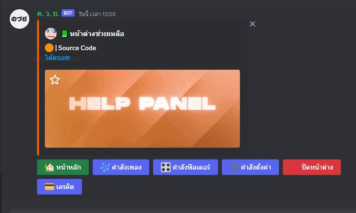
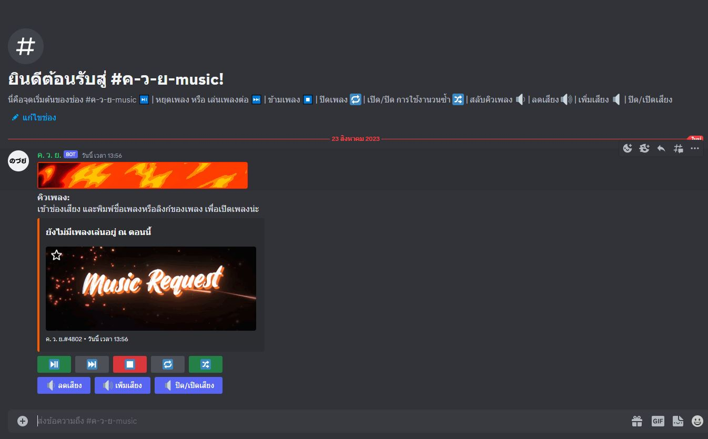
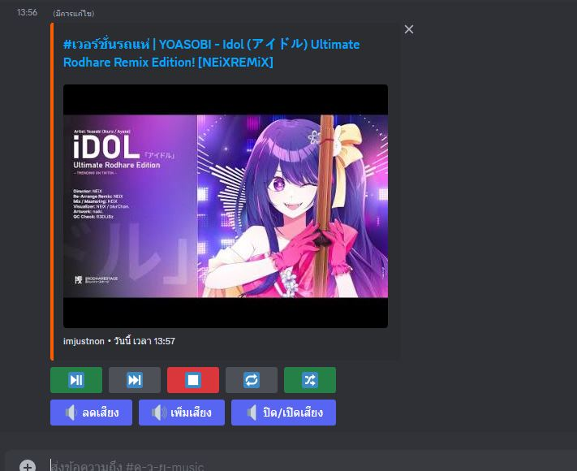
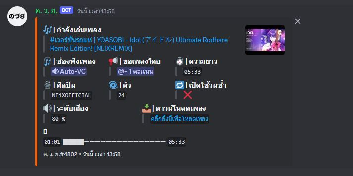

<h1>Music Bot With Request Channel</h1>

โปรเจคนี้คือ 🤖บอทเพลง🎵 ที่ไม่ใช้เเค่ใช้คำสั่ง(PREFIX) เเต่สามารถสร้างช่องสำหรับส่งเพลงให้บอทไป้เปิดโดยเฉพาะ โดยไม่ต้อใช้คำสั่งอะไรทั้งนั้น

(ที่จริงตอนเเรกกะจะทำเล่นๆ เลยล่อทำมันในไฟล์เดียวเเม่งเลย 555 ถ้าจะเอาไปศึกษา ก็อาจจะปวดหัวหน่อยๆ SORRY💦 เเต่ถ้าจะเอาไปเปิดเล่นก็เอาไปโลดดด💨 โหลดไปเลยยยย🏳‍🌈 )

<h1>⚠ Requirements</h1>
<ul>
    <li>yarn v.1.22.X</li>
    <li>MongoDB (connection string)</li>
    <li>Nodejs v.18.X.X (I use Nodejs v.18.11.0 in my development)</li>
    <li>Discord.js v.12 (In this project i use Discord.js v.12.5.3)</li>
    <li><strong>Lavalink server</strong>  (The lastest test i use Lavalink v.3.7.8)</li>
</ul>

<h1>🧭 How to install </h1>
<ol>
    <li>โหลดโค้ดลงเครื่องให้เรียบร้อย หรือ ใช้ <code>git clone https://github.com/ImJustNon/Music-bot-with-request-channel.git</code> ก็ได้</li>
    <li>ติดตั้ง Dependencies ให้เรียบร้อย โดยใช้คำสั่ง <code>yarn install</code> (ไม่เเน่ใจ NPM เเเต่จะลองก็ได้)</li>
    <li>สร้างไฟล์ตั้งค่า BOT ที่ .env โดยการสร้างไฟล์ <code>.env</code> เเละก็อปสิ่งที่อยู่ใน <code>example.env</code> มา</li>
    <li>วิธีตั้งค่า Bot อธิบายตามตัวเเปร
        <ul>
            <li>token => Token บอทเอามาจาก <a href='https://discord.com/developers/'>Discord Developer Portal<a></li>
            <li>prefix => คำนำหน้าคำสั่งเพื่อให้บอทรู้ว่าเราจะสั่งบอท เช่น <code>!</code></li>
            <li>ownerID => เลข id ของเจ้าของบอท <a href="https://support.discord.com/hc/en-us/articles/206346498-Where-can-I-find-my-User-Server-Message-ID-">How to get my ID</a></li>
            <li>mongoURL => MongoDB connection string สามารถสมัครเเละเอาได้ที่ <a href="https://www.mongodb.com/atlas/database">MongoDB</a></li>
            <li>app_port => สำหรับเอาไปใส่ในเว็ป Uptime จะใส่เลขอะไรก็ได้ เช่น <code>8080</code></li>
            <li>host, port, pass, secure => คือ เซิฟเวอร์ Lavalink ของเราหากเปิดบนเครื่องของเรา(Local) ให้ตั้ง <code>secure = false</code> หรือขี้เกียจลง Lavalink สามารถใช้ <a href="https://lavalink.darrennathanael.com">Lavalink ฟรี</a> ได้</li>
            <li>spotifyID, spotifySecret => สามารถไปเอาได้ที่ <a href="https://developer.spotify.com/dashboard">Spotify for Developer</a></li>
        </ul>
    </li>
    <li>รันบอทโดยใช้คำสั่ง <code>yarn start</code> หรือ <code>node index.js</code> ก็ได้</li>
    <li>🎉 เย่บอทน่าจะออนไลน์เเล้วล่ะ</li>
</ol>

<h1>✨ Preview Screenshot<h1>

😎 By NonLnwza 🤯

